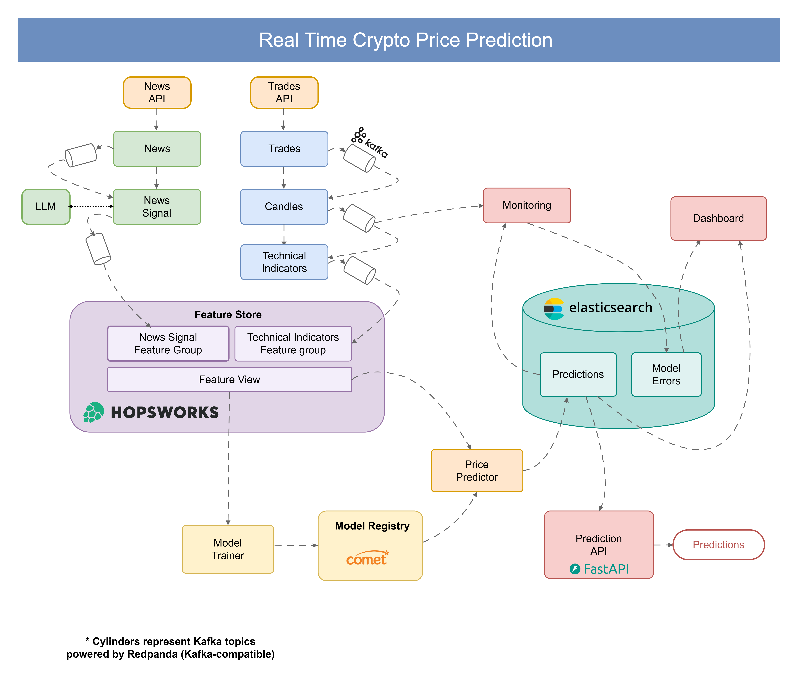
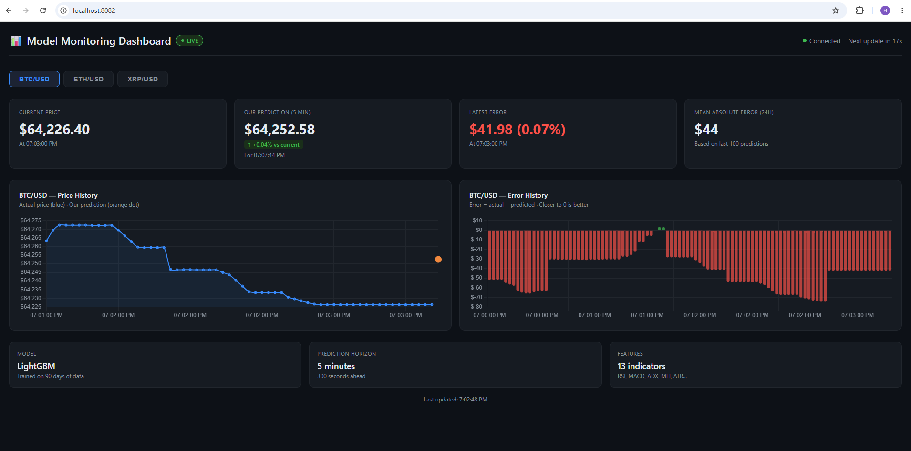
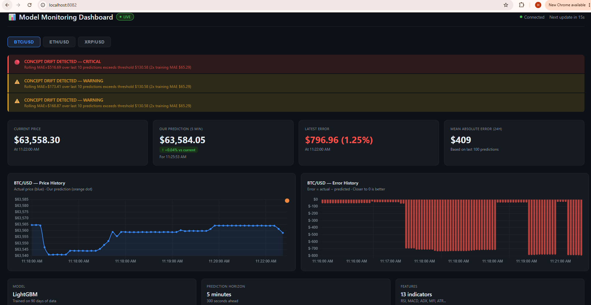

# Real-Time Crypto Price Prediction

A production grade real-time machine learning pipeline that predicts BTC/USD price 5 minutes into the future. Built with an event-driven microservices architecture using industry standard MLOps tools.

---

## Architecture



The system consists of 9 microservices across two data pipelines, a shared feature store, an offline training pipeline, and a real-time inference + monitoring layer.

---

## Live Dashboard

### Normal Operation — MAE ~$44 (0.07%)



### Drift Detected — Rolling MAE $409 (Critical Alert)



> When BTC dropped to $63,558 — below our training range of $67k–$82k. The monitoring service immediately raised a **CRITICAL** concept drift alert as the rolling MAE jumped from ~$44 to $409, correctly identifying that the model needed retraining. This is what production ML monitoring looks like in practice.

---

## Model Performance

| Metric | Value |
|--------|-------|
| Training MAE (test set) | $65.29 |
| Walk-forward validation MAE | $57.95 |
| Live MAE (normal conditions) | ~$44 |
| Live MAE (drift period) | ~$409 |
| Concept drift threshold | $130.58 (2× training MAE) |
| Prediction horizon | 5 minutes (300 seconds) |
| Features | 13 technical indicators |
| Training data | 90 days (March–June 2026) |

The walk-forward validation ($57.95) shows consistent performance across time periods — not just a single lucky test split.

---

## Tech Stack

### Data Pipeline
| Tool | Purpose |
|------|---------|
| Kraken API | Live trade data (WebSocket + REST) |
| CryptoPanic API | Crypto news feed |
| Redpanda | Kafka-compatible message broker (no Zookeeper) |
| QuixStreams | Kafka client for all services |

### Feature Store & Training
| Tool | Purpose |
|------|---------|
| Hopsworks | Feature store (online + offline) |
| XGBoost / LightGBM | ML models |
| Optuna | Hyperparameter tuning |
| CometML | Experiment tracking + model registry |

### Inference & Serving
| Tool | Purpose |
|------|---------|
| ElasticSearch | Stores predictions, errors, drift alerts |
| FastAPI | Prediction REST API |
| Docker Compose | Local deployment |

### CI/CD & Quality
| Tool | Purpose |
|------|---------|
| GitHub Actions | CI pipeline (lint + unit tests) |
| Ruff | Python linting and formatting |
| Pytest | 67 unit tests across 4 services |

---

## How It Works

### Price Data Pipeline
```
Kraken API → trades → candles (OHLCV 60s) → technical-indicators → to-feature-store → Hopsworks
```
All services communicate via Redpanda Kafka topics: `trades_topic → candles_topic → technical_indicators_topic`

### News Pipeline
```
CryptoPanic API → news → news-signal (LLM sentiment: -1/0/+1) → to-feature-store → Hopsworks
```
Kafka topics: `news_topic → news_signal_topic`

### Training Pipeline (Offline)
```
Hopsworks (offline store) → training.py → CometML (model registry)
```
- Optuna hyperparameter tuning with walk-forward cross-validation
- Model registered to CometML as Production when it beats the dummy baseline
- Training feature statistics saved to CometML for drift detection

### Inference Pipeline (Live)
```
Redpanda (candles_topic) → price-predictor → ElasticSearch
```
- price-predictor loads LightGBM model from CometML at startup
- Reads real-time features from Hopsworks online store
- `prediction = current_price + predicted_delta`
- Writes prediction to ElasticSearch `price_prediction` index

### Monitoring
```
Redpanda (candles_topic) + ElasticSearch → monitoring-service → ElasticSearch (errors + drift)
```
**Data drift:** Z-score on each input feature. |z| > 3σ = warning, |z| > 4σ = critical. 5-minute cooldown per feature.

**Concept drift:** Rolling MAE over last 100 predictions. If rolling MAE > $130.58 (2× training MAE) → drift alert.

---

## Key Design Decisions

**Why Redpanda instead of Kafka?**
Redpanda is fully Kafka-compatible so all services use standard Kafka clients via QuixStreams. We chose Redpanda because it runs without Zookeeper, making local Docker setup simpler. In production we would use managed Kafka on Confluent Cloud or AWS MSK.

**Why delta prediction instead of absolute price?**
Early models predicted absolute price (e.g. $65,000) which gave MAE of ~$22,000 — the model just learned the average price. Switching to delta (price change) reduced MAE to $65.29 — a 2,400× improvement.

**Why CometML instead of MLflow?**
CometML provides a managed experiment tracking and model registry 
out of the box, which allowed us to focus on the ML pipeline rather 
than infrastructure setup. In a larger production environment we 
would evaluate MLflow with a self-hosted tracking server to avoid 
vendor dependency and reduce cost.

**Why Z-score for data drift instead of KS test?**
KS test needs 50–100 samples before it can detect drift (50–100 minute delay). Z-score detects drift on a single candle immediately — critical for a real-time system.

**Why not implement data drift on bounded indicators (RSI, ADX, MFI)?**
These oscillators are bounded 0–100. A Z-score threshold of 3σ would require values above 110 or below -10 — statistically impossible. We rely on concept drift (rolling MAE) to catch model degradation from these features.

---

## Project Structure

```
crypto-price-prediction/
├── services/
│   ├── trades/                  # Fetches raw trades from Kraken
│   ├── candles/                 # Aggregates trades into OHLCV candles
│   ├── technical-indicators/    # Computes technical indicators
│   ├── to-feature-store/        # Writes features to Hopsworks
│   ├── news/                    # Fetches crypto news from CryptoPanic
│   ├── news-signal/             # LLM sentiment extraction (-1/0/+1)
│   ├── price-predictor/         # Real-time inference service
│   │   ├── training.py          # Offline training pipeline
│   │   ├── inference.py         # Live inference entry point
│   ├── monitoring-service/      # Drift detection + live dashboard
│   └── prediction-api/          # FastAPI REST endpoints
├── docker-compose/
│   ├── redpanda.yml                        # Kafka message broker
│   ├── elasticsearch.yml                   # Search and storage
│   ├── technical-indicators-historical.yml # Collect historical price data
│   ├── technical-indicators-live.yml       # Live price data pipeline
│   ├── news-signal-historical.yml          # Collect historical news data
│   ├── news-signal-live.yml                # Live news pipeline
│   └── inference-live.yml                  # Inference + monitoring + API
├── .github/
│   └── workflows/
│       └── ci.yml               # GitHub Actions CI pipeline
└── README.md
```

---

### Credentials Setup

Each service needs its own credentials files. Create these files manually:

**Hopsworks** (`hopsworks_credentials.env`):
```env
HOPSWORKS_PROJECT_NAME=your_project_name
HOPSWORKS_API_KEY=your_api_key
HOPSWORKS_HOST=your-project.cloud.hopsworks.ai
```

**CometML** (`comet_ml_credentials.env`):
```env
API_KEY=your_api_key
PROJECT_NAME=your_project_name
WORKSPACE=your_workspace
```

> These files are in `.gitignore` and never committed to the repository.

## Running Locally

### Prerequisites
```bash
Docker Desktop
Python 3.12+
uv (Python package manager)
```

### Step 1 — Clone the repository
```bash
git clone https://github.com/Hritik0607/crypto-price-prediction.git
cd crypto-price-prediction
```

### Step 2 — Set up credentials
Create the credentials files shown above in each service folder that needs them.

### Step 3 — Start infrastructure
Start Redpanda (Kafka) and ElasticSearch first. Everything else depends on these.

```bash
# Start message broker
docker compose -f docker-compose/redpanda.yml up -d

# Start search and storage
docker compose -f docker-compose/elasticsearch.yml up -d
```

### Step 4 — Collect historical data for training
Run the historical pipelines to collect 90 days of feature data into Hopsworks.

```bash
# Collect technical indicators (price data)
docker compose -f docker-compose/technical-indicators-historical.yml up

# Collect news signals
docker compose -f docker-compose/news-signal-historical.yml up
```

> These pipelines fetch historical data and write to Hopsworks feature store.
> Wait for them to complete before training.

### Step 5 — Train the model
```bash
cd services/price-predictor
uv run python training.py
```

This will:
- Read features from Hopsworks offline store
- Run Optuna hyperparameter tuning
- Perform walk-forward validation
- Register the best model to CometML as Production

### Step 6 — Start live data pipelines
Start the live streaming services that feed real-time data into the system.

```bash
# Live technical indicators (price pipeline)
docker compose -f docker-compose/technical-indicators-live.yml up -d

# Live news signals (news pipeline)
docker compose -f docker-compose/news-signal-live.yml up -d
```

### Step 7 — Start inference and monitoring
```bash
docker compose -f docker-compose/inference-live.yml up -d
```

This starts:
- `price-predictor` — loads model from CometML, makes predictions every 60 seconds
- `prediction-api` — REST API at `http://localhost:8081`
- `monitoring-service` — drift detection + dashboard at `http://localhost:8082`

### Step 8 — Open dashboard
```
http://localhost:8082
```

## CI/CD

GitHub Actions runs on every push to `main`:

```
✓ Lint (ruff check + ruff format)
✓ Unit tests — trades service (10 tests)
✓ Unit tests — candles service (17 tests)
✓ Unit tests — price-predictor service (9 tests)
✓ Unit tests — monitoring-service (20 tests)
```

---

## What I Learned

This project taught me what separates a notebook ML model from a production ML system:

- **Feature stores** separate training and inference pipelines cleanly
- **Delta prediction** is more stable than absolute price prediction
- **Walk-forward validation** gives more realistic performance estimates than a single train/test split
- **Drift detection** is essential — a model that worked last month may not work today
- **Event-driven architecture** with Kafka decouples services and enables real-time processing
- **Microservices** make each component independently testable and deployable

---

## Future Improvements

```
- Continuously retrain model with recent market data to capture
  current price regimes, bull/bear trends, and latest market behaviour
- Add CD pipeline for automatic retraining on drift detection
- Add WebSocket auto-reconnect for trades service
- Deploy to cloud (AWS/GCP) with managed Kafka
- Add more trading pairs
```

---

## Author

**Hritik** — [GitHub](https://github.com/Hritik0607)
